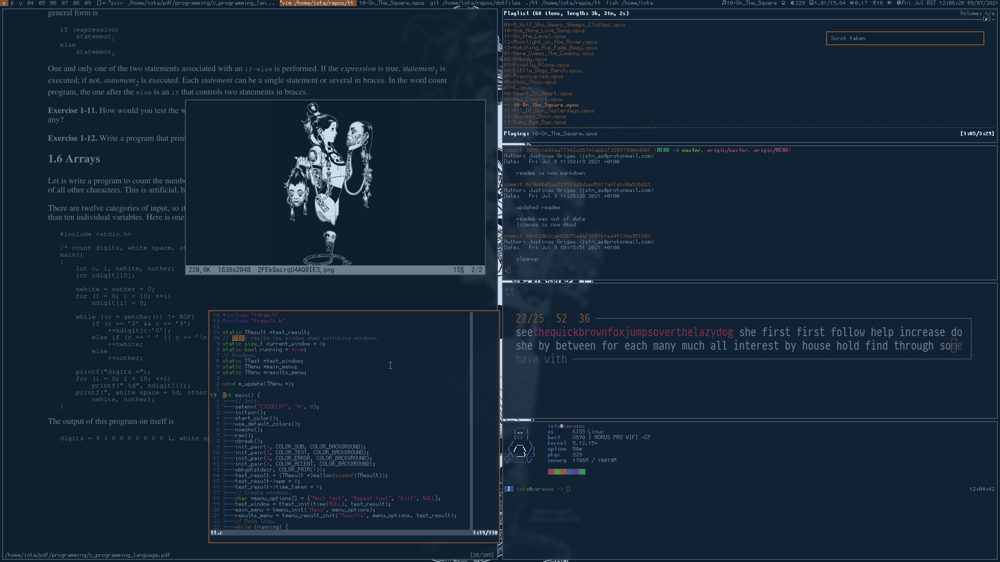

# dots - personal dotfiles

## Deploy

	./deploy/strelitzia-artix

## Programs

* distro -
[kisslinux](https://kisslinux.org/) on cerasus,
[artix](https://archlinux.org) on strelitzia
* wm -
[dwm](https://dwm.suckless.org/) +
[picom](https://github.com/yshui/picom) +
[sx](https://github.com/Earnestly/sx) on x11,
[sway](https://swaywm.org/) on wl
* term -
[st](https://st.suckless.org/) on x11,
[foot](https://codeberg.org/dnkl/foot) on wl
* shell -
[fish](https://fishshell.com) +
[dash](http://gondor.apana.org.au/~herbert/dash/) for `/bin/sh`
* editor -
[neovim](https://neovim.io)
* statusbar -
[dwmblocks](https://github.com/torrinfail/dwmblocks) on x11,
[i3blocks](https://github.com/vivien/i3blocks) on wl
* clipboard -
[xclip](https://github.com/astrand/xclip) on x11,
[wl-clipboard](https://github.com/bugaevc/wl-clipboard) on wl
* scrot -
[maim](https://github.com/naelstrof/maim) on x11,
[grim](https://wayland.emersion.fr/grim/) +
[slurp](https://wayland.emersion.fr/slurp/) on wl
* notification daemon -
[dunst](https://github.com/dunst-project/dunst) on x11,
[fnott](https://codeberg.org/dnkl/fnott) on wl
* wallpaper -
None
* image viewer -
[sxiv](https://github.com/muennich/sxiv) on x11
* sound -
[pipewire](https://pipewire.org/)
* music -
[mpd](https://www.musicpd.org) +
[ncmpcpp](https://rybczak.net/ncmpcpp)
* network -
[iwd](https://iwd.wiki.kernel.org/) on strelitzia
* browser -
[librewolf](https://librewolf.net/)
* cursor -
[posy's cursor](http://www.michieldb.nl/other/cursors/),
[xbanish](https://github.com/jcs/xbanish) to hide it on x11

## Fonts

* [Gohufont](https://font.gohu.org)
* [JetBrains Mono](https://www.jetbrains.com/lp/mono/)
* [siji](https://github.com/stark/siji)
* [stix](https://www.stixfonts.org)

## Wallpapers

* [Zeen Chin](https://nitter.net/zeen_chin/media)
* [Acky Bright](https://nitter.net/aki001208/media)
* [A.Shipwright](https://nitter.net/shipwrighta/media)
* [屁屁弹](https://nitter.net/pp_bullet/media)

## Colours

* [gruvbox](https://github.com/morhetz/gruvbox)
* [mellow](https://gist.github.com/jstnas/fc85c6253a632409d2545100d085dfd7)

## Scrots

## References

* [unixporn](https://www.reddit.com/r/unixporn/)
* [xero's dotfiles](https://github.com/xero/dotfiles)
